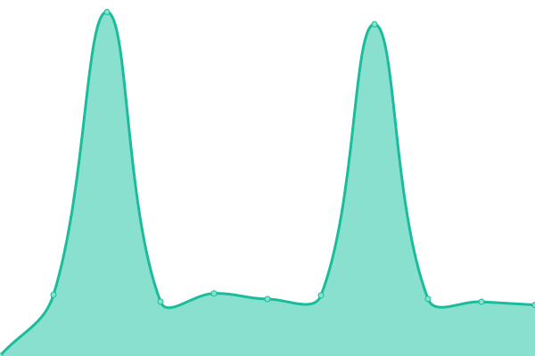
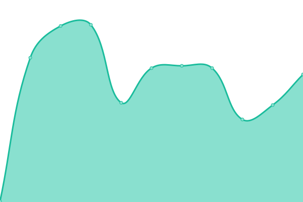
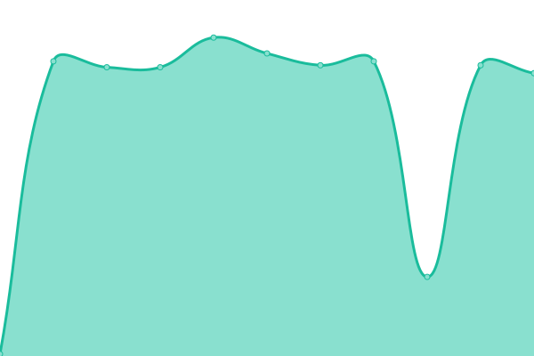

# [📈 Live Status](https://upptime.dixneuf19.me): <!--live status--> **🟧 Partial outage**

This repository contains the open-source uptime monitor and status page for [Julen Dixneuf](https://upptime.dixneuf19.me), powered by [Upptime](https://github.com/upptime/upptime).

With [Upptime](https://upptime.js.org), you can get your own unlimited and free uptime monitor and status page, powered entirely by a GitHub repository. We use [Issues](https://github.com/dixneuf19/upptime/issues) as incident reports, [Actions](https://github.com/dixneuf19/upptime/actions) as uptime monitors, and [Pages](https://upptime.dixneuf19.me) for the status page.

<!--start: status pages-->
<!-- This summary is generated by Upptime (https://github.com/upptime/upptime) -->
<!-- Do not edit this manually, your changes will be overwritten -->

| URL                                                  | Status  | History                                                                                                            | Response Time                                                                             | Uptime                                                                                                                                                                                                                                 |
| ---------------------------------------------------- | ------- | ------------------------------------------------------------------------------------------------------------------ | ----------------------------------------------------------------------------------------- | -------------------------------------------------------------------------------------------------------------------------------------------------------------------------------------------------------------------------------------- |
| [Dixneuf19 website](https://www.dixneuf19.me)        | 🟩 Up   | [dixneuf19-website.yml](https://github.com/dixneuf19/upptime/commits/master/history/dixneuf19-website.yml)         |  695ms    |        |
| Radio France Open API                                | 🟥 Down | [radio-france-open-api.yml](https://github.com/dixneuf19/upptime/commits/master/history/radio-france-open-api.yml) |  0ms  |  |
| [loudnaround.org](https://loudnaround.org)           | 🟩 Up   | [loudnaround-org.yml](https://github.com/dixneuf19/upptime/commits/master/history/loudnaround-org.yml)             |  759ms      |            |
| [mangococo.fr](https://www.mangococo.fr/)            | 🟩 Up   | [mangococo-fr.yml](https://github.com/dixneuf19/upptime/commits/master/history/mangococo-fr.yml)                   |  531ms         |                  |
| [This Upptime website](https://upptime.dixneuf19.me) | 🟩 Up   | [this-upptime-website.yml](https://github.com/dixneuf19/upptime/commits/master/history/this-upptime-website.yml)   |  144ms |  |

<!--end: status pages-->

[**Visit our status website →**](https://upptime.dixneuf19.me)

## 📄 License

- Code: [MIT](./LICENSE) © [Julen Dixneuf](https://upptime.dixneuf19.me)
- Data in the `./history` directory: [Open Database License](https://opendatacommons.org/licenses/odbl/1-0/)
